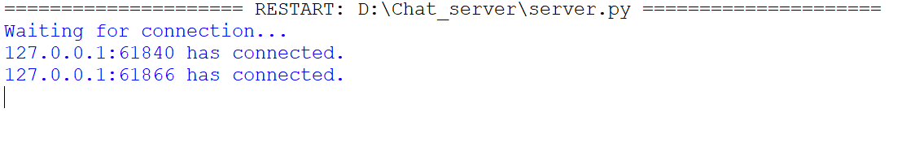
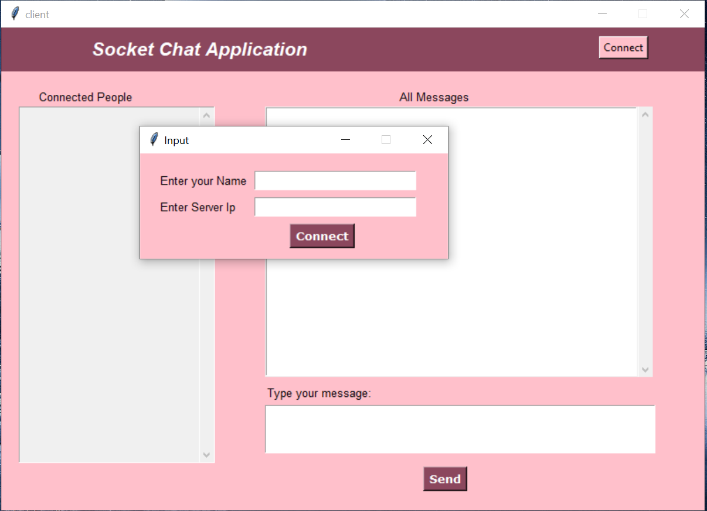
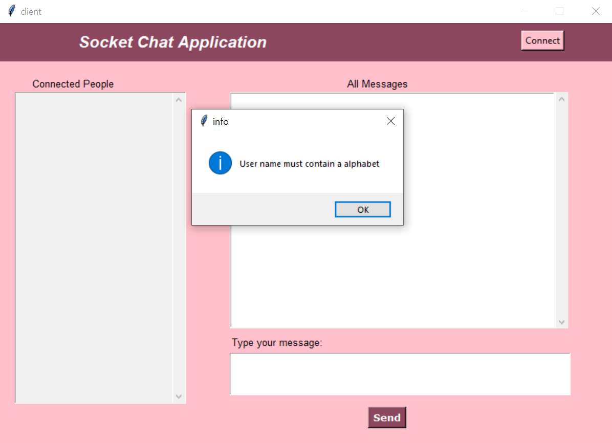
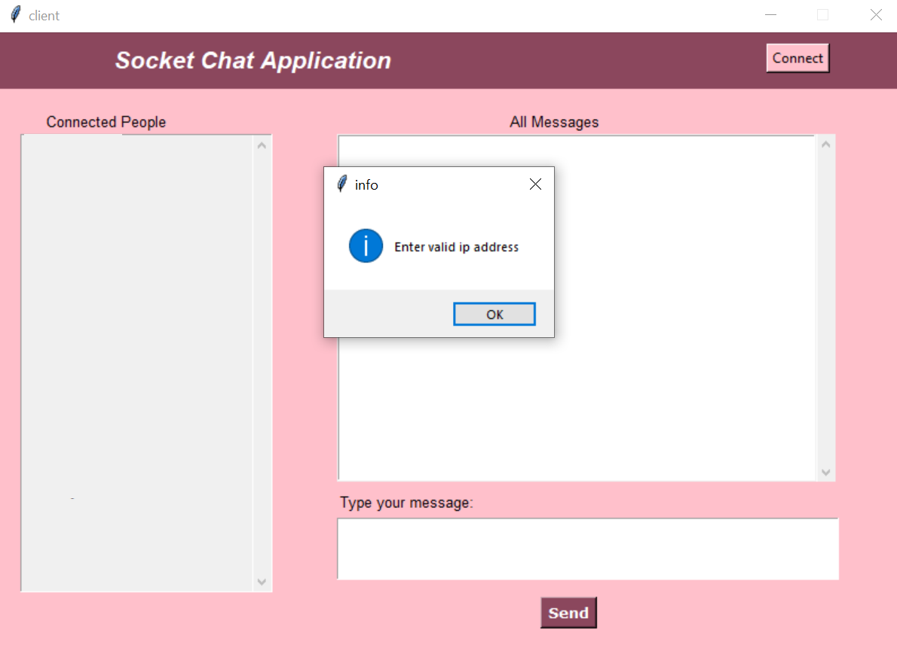
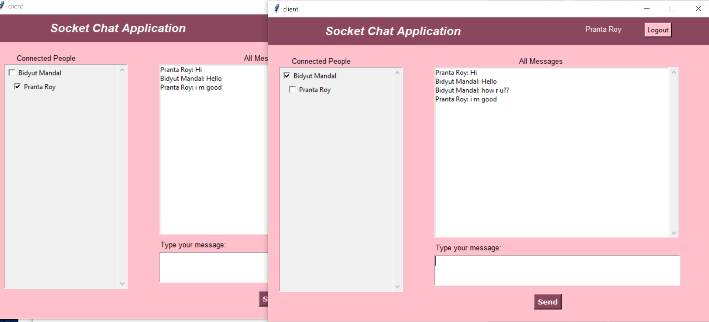

# Chat-Application
GUI chat application using Tkinter in Python Socket programming
<h1 align="center">Multi-user Group Chat Application</h1>
 <ul>
  <li>
   
This is an example of chat application which is basically based on public chatting (message is broadcast to
    all
    connected users , individual and multi-user).

  </li>
  <li>
   
It is made of two application.

  </li>
  <li>
   
Clint application which runs on user’s Pc.

  </li>
  <li>
   
Server application which runs on any Pc on the network.

  </li>
  <li>
   
To start chatting client should get connected to server.

  </li>
 </ul>
 <h3>Server Modules:</h3>
 
A server is a specially equipped computer connected to the internet that allows users with chat clients to converse
  with
  one another via typed messages in real time.
 

 <h3>Client Module</h3>
 
A client is a software program that allows users to connect to chat servers and communicate with other users via a
  chat
  room.

 
 
 
 
 
